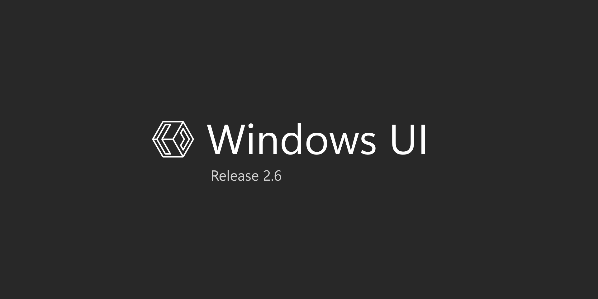

## React Windows UI

:art: UI Kit built with React based on [Windows UI](https://www.figma.com/community/file/989931624019688277)

## 📦 How to install

To use React Win UI, you just need to install the react-win-ui package:

```bash
$ yarn add react-win-ui

# or

$ npm i react-win-ui
```

## 🔨 Usage

To start using the components you need to wrap your application with the `ThemeProvider` provided by react-win-ui

```javascript
import { ThemeProvider } from 'react-win-ui'

// Do this at the root of your application
function App({ children }) {
  return <ThemeProvider>{children}</ThemeProvider>
}
```

## :hammer_and_wrench: Development tools

- :atom: [ReactJS](https://pt-br.reactjs.org/)
- :collision: [TypeScript](https://www.typescriptlang.org/)
- :books: [Storybook](https://storybook.js.org/)
- :pill: [Jest](https://jestjs.io/pt-BR/)
- :bookmark: [React Testing Library](https://testing-library.com/docs/react-testing-library/intro)
- :pencil2: [Styled Components](https://styled-components.com/)

### :construction_worker: Built by:

<table>
  <tr>
    <td align="center"><a href="https://github.com/gaoliveira21"><br /><sub><b>Gabriel Oliveira</b></sub></a><br /></td>
  </tr>
</table>
